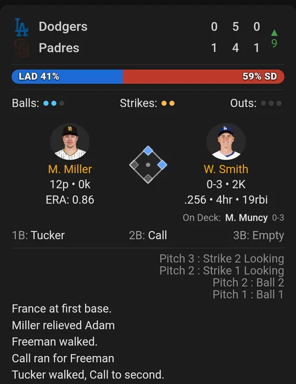
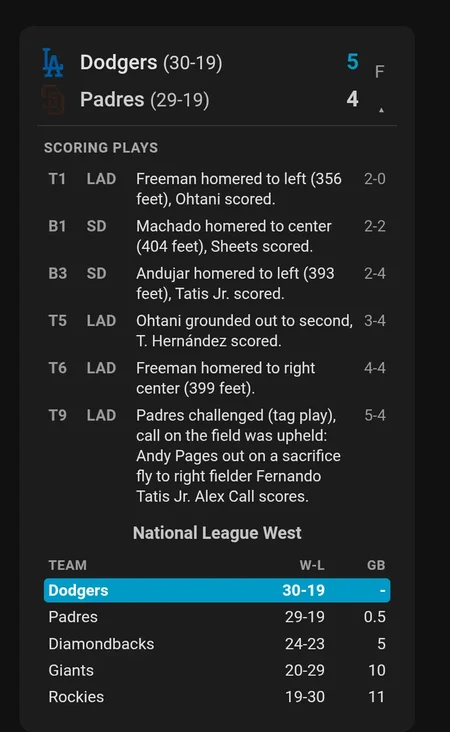
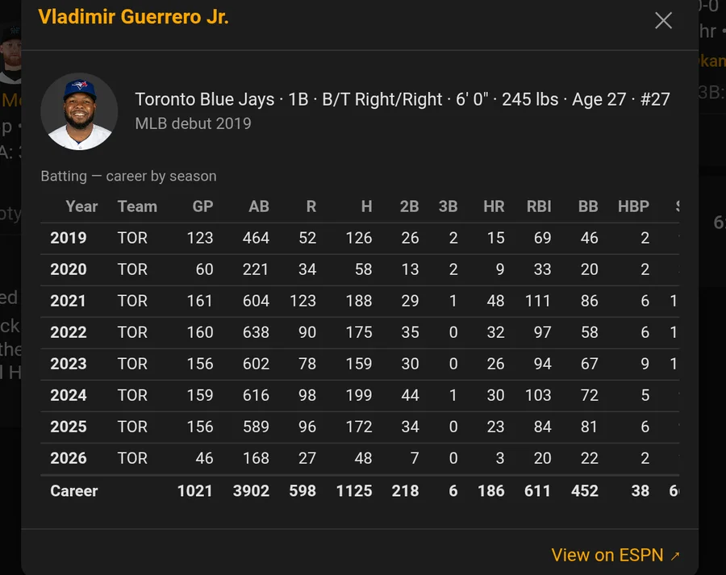
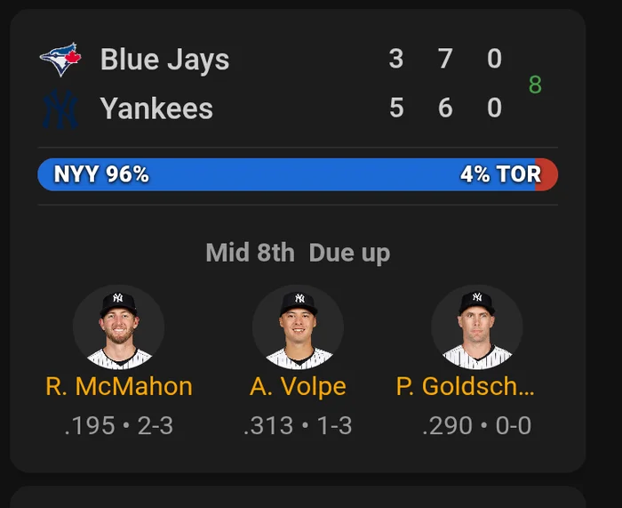
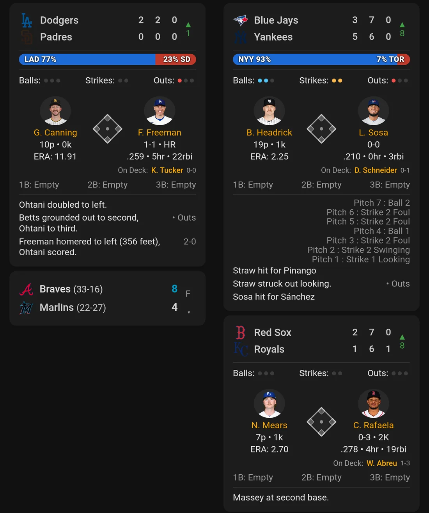

# MLB Live Scoreboard / GameTracker

A Home Assistant custom integration and Lovelace card for displaying live MLB game data from ESPN.


## Features

- **Live game tracking** - Real-time scores, innings, count, and base runners
- **Pitcher/Batter matchup** - Current at-bat with player headshots and stats
- **Play-by-play** - Recent plays and pitch-by-pitch updates
- **Pre-game info** - Scheduled game times and probable pitchers
- **Post-game results** - Final scores and game leaders
- **Compact-card expand panel** - Click an upcoming or completed game card to expand it. Upcoming games show probable starters + current division standings; completed games show every scoring play of the game + game leaders (top hitters / pitchers per side) above the same standings block
- **Player career popup** - Click any (yellow) player name to open an in-card popup with their bio and season-by-season career stats; configurable to open ESPN's player page instead (`player_link_target`)
- **Team lineup popup** - Click a team's side of the pitcher/batter matchup (anywhere but the player name) to open an in-card popup with that team's full lineup and every player who appeared in the game, toggleable between **Game** (this game's box score) and **Season** stats for hitters and pitchers
- **Configurable game-event actions** - Fire Home Assistant events (or invoke services directly from the integration options) on team scored, opponent scored, game won, game lost, and game started, so you can drive lights, TTS, notifications, or any other automation. See [Game Event Actions](#game-event-actions) below.
- **Configurable display** - Toggle various UI elements on/off
- **Auto-registered card** - The Lovelace card is automatically registered on install

## Screenshots

**Live game** — scoreline, live win probability, count + outs, pitcher/batter matchup with portraits, base runners, pitch sequence, and recent plays.

<p align="center"></p>

**Final game with scoring summary** — click a completed game's card to expand it and see every scoring play of the game plus the current division standings.

<p align="center"></p>

**Player career popup** — click any (yellow) player name to open an in-card popup with that player's bio and season-by-season career stats.

<p align="center"></p>

**Between-innings due-up panel** — after the third out, the matchup row swaps to show the next three batters' portraits and stats until the half-inning ends.

<p align="center"></p>

**Track multiple teams** — one card per team, each independently configurable, sharing the dashboard with the rest of your Home Assistant tiles.

<p align="center"></p>

## Installation

### HACS (Recommended)

1. Open HACS in Home Assistant
2. Click the three dots in the top right and select "Custom repositories"
3. Add this repository URL and select "Integration" as the category
4. Click "Install"
5. Restart Home Assistant

The JavaScript card is automatically served by the integration - no manual file copying needed!

### Manual Installation

1. Copy the `custom_components/mlb_live_scoreboard` folder to your Home Assistant `config/custom_components/` directory
2. Restart Home Assistant

## Configuration

### Integration Setup

1. Go to **Settings → Devices & Services → Add Integration**
2. Search for "MLB Live Scoreboard"
3. Select your team (e.g., LAD for Los Angeles Dodgers)
4. Enter a display name (optional)

This creates a sensor entity like `sensor.mlb_live_scoreboard_lad`.

### Lovelace Card Setup

The card resource is automatically registered at `/mlb_live_scoreboard/mlb-live-game-card.js`.

If the auto-registration doesn't work, manually add the resource:

1. Go to **Settings → Dashboards → ⋮ → Resources**
2. Add URL: `/mlb_live_scoreboard/mlb-live-game-card.js`
3. Type: **JavaScript Module**

Add the card to your dashboard — either way:

- **Visual (no YAML):** _Edit dashboard → Add card → search "MLB Live Game Card"_. The picker shows a live preview; the card lands pre-configured against the first MLB Live Scoreboard sensor it finds. Every option below is exposed as a form field — click **Edit** on the card and use the **Visual editor** tab.
- **YAML** (equivalent):

  ```yaml
  type: custom:mlb-live-game-card
  entity: sensor.mlb_live_scoreboard_lad
  title: Dodgers
  ```

## Card Configuration Options

| Option                 | Type    | Default      | Description                                                                                                                                                                                                                                                                                              |
| ---------------------- | ------- | ------------ | -------------------------------------------------------------------------------------------------------------------------------------------------------------------------------------------------------------------------------------------------------------------------------------------------------- |
| `entity`               | string  | **required** | The MLB scoreboard sensor entity                                                                                                                                                                                                                                                                         |
| `title`                | string  | Team name    | Card title                                                                                                                                                                                                                                                                                               |
| `refresh_rate`         | number  | `0`          | Auto-refresh interval in seconds (0 = disabled)                                                                                                                                                                                                                                                          |
| `show_batter`          | boolean | `true`       | Show pitcher/batter matchup panel                                                                                                                                                                                                                                                                        |
| `show_records`         | boolean | `true`       | Show team win/loss records                                                                                                                                                                                                                                                                               |
| `show_linescore`       | boolean | `false`      | Show detailed inning-by-inning linescore                                                                                                                                                                                                                                                                 |
| `show_pitches`         | boolean | `true`       | Show pitch-by-pitch display                                                                                                                                                                                                                                                                              |
| `show_play_results`    | boolean | `true`       | Show play-by-play results                                                                                                                                                                                                                                                                                |
| `show_on_deck`         | boolean | `true`       | Show on-deck batter                                                                                                                                                                                                                                                                                      |
| `show_base_occupancy`  | boolean | `true`       | Show base runner names                                                                                                                                                                                                                                                                                   |
| `show_diamond`         | boolean | `true`       | Show base diamond graphic                                                                                                                                                                                                                                                                                |
| `show_count`           | boolean | `true`       | Show balls/strikes/outs dots                                                                                                                                                                                                                                                                             |
| `show_win_probability` | boolean | `true`       | Show live win-probability bar between the score rows and the balls/strikes/outs row (hidden pre-game when ESPN doesn't yet publish a probability series)                                                                                                                                                 |
| `player_link_target`   | string  | `popup`      | What clicking a (yellow) player name does: `popup` opens an in-card career-stats popup; `espn` opens ESPN's player page directly. The popup always includes a "View on ESPN" link, so ESPN stays reachable either way                                                                                    |
| `show_lineup_popup`    | boolean | `true`       | Allow clicking a team's side of the matchup to open the team-lineup popup. Set `false` to make the matchup sides inert (player-name links still work)                                                                                                                                                    |
| `lineup_default_view`  | string  | `auto`       | Which view the lineup popup opens to: `auto` (Game while the game is live, Season otherwise), or force `game` / `season`                                                                                                                                                                                 |
| `headshot_size`        | string  | `auto`       | Size of inline headshots (matchup, due-up, probable pitchers). `auto` scales them with the card's actual width via a CSS container query — responsive to HA's per-column dashboards. Fixed presets: `small` (40px), `medium` (56px), `large` (72px), `xlarge` (88px). Modal-popup avatars are unaffected |

### Example with all options

```yaml
type: custom:mlb-live-game-card
entity: sensor.mlb_live_scoreboard_lad
title: Dodgers
refresh_rate: 10
show_batter: true
show_records: true
show_linescore: false
show_pitches: true
show_play_results: true
show_on_deck: true
show_base_occupancy: true
show_diamond: true
show_count: true
show_win_probability: true
player_link_target: popup
show_lineup_popup: true
lineup_default_view: auto
headshot_size: auto
```

## Game Event Actions

The integration fires Home Assistant events on the bus whenever notable
in-game things happen for the team you've configured. You can react to
these in two ways:

1. **Built-in options flow** — quick & visual: Settings → Devices & Services →
   _MLB Live Scoreboard_ → **Configure**. Each event has a field that accepts
   any sequence of Home Assistant actions (call services, run scripts, fire
   notifications, activate scenes, etc.).
2. **Automations against the event bus** — more flexible: write your own
   automations triggered on the events listed below. Use this when you need
   conditions, multi-step logic, or want different behavior in different
   automations.

Both mechanisms work simultaneously. Configured options run in addition to,
not instead of, any automations you have listening for the same events.

### Events fired

| Event type                            | When it fires                                   |
| ------------------------------------- | ----------------------------------------------- |
| `mlb_live_scoreboard_team_scored`     | Your team's score increased since the last poll |
| `mlb_live_scoreboard_opponent_scored` | The opposing team's score increased             |
| `mlb_live_scoreboard_game_started`    | The game transitioned from scheduled to live    |
| `mlb_live_scoreboard_game_ended`      | The game transitioned to final (any result)     |
| `mlb_live_scoreboard_game_won`        | Game ended and your team won                    |
| `mlb_live_scoreboard_game_lost`       | Game ended and your team lost                   |

A tie/suspension fires `game_ended` but neither `game_won` nor `game_lost`.

### Event payload

Every event includes the same base payload, with two extra fields on
score-change events:

| Field               | Type   | Description                                             |
| ------------------- | ------ | ------------------------------------------------------- |
| `team_abbr`         | string | Your configured team's abbreviation, e.g. `"LAD"`       |
| `team_name`         | string | Your configured team's display name                     |
| `team_score`        | int    | Your team's score _after_ this event                    |
| `opponent_abbr`     | string | Opposing team's abbreviation                            |
| `opponent_name`     | string | Opposing team's display name                            |
| `opponent_score`    | int    | Opponent's score _after_ this event                     |
| `is_home`           | bool   | True if your team is the home side                      |
| `inning`            | int    | Current inning number (0 if not started)                |
| `inning_half`       | string | `"top"`, `"bottom"`, or `""`                            |
| `event_id`          | string | ESPN event ID for the game                              |
| `status_detail`     | string | Human-readable status text, e.g. `"Bot 7th"`            |
| `score_delta`       | int    | (`*_scored` only) How many runs scored on this play     |
| `scoring_play_text` | string | (`*_scored` only) ESPN play description, when available |

### Detection rules

- The first refresh after Home Assistant starts only **establishes a
  baseline** — it does not fire any events. Score and state changes are
  detected on subsequent refreshes.
- When a new game appears (different `event_id`), no events are fired for
  that polling cycle to avoid spurious score events across game boundaries.
  The next refresh becomes the new baseline.
- `team_scored` / `opponent_scored` only fire on positive score deltas, and
  are suppressed while the game is delayed (since ESPN occasionally
  corrects scores during a delay).
- `game_ended` / `game_won` / `game_lost` only fire on the _transition_
  into the final state — they will not re-fire on subsequent refreshes
  while the game remains final.

### Example: automation triggered by a bus event

```yaml
automation:
  - alias: "Flash lights and notify when Dodgers score"
    trigger:
      platform: event
      event_type: mlb_live_scoreboard_team_scored
      event_data:
        team_abbr: LAD
    action:
      - service: light.turn_on
        target:
          entity_id: light.living_room
        data:
          flash: short
          color_name: blue
      - service: notify.mobile_app_phone
        data:
          title: >-
            Dodgers scored! ({{ trigger.event.data.team_score }}-{{
            trigger.event.data.opponent_score }})
          message: "{{ trigger.event.data.scoring_play_text }}"
```

### Example: configured action via the options flow

In the options flow's **When my team wins** field:

```yaml
- service: notify.persistent_notification
  data:
    title: "{{ team_name }} won!"
    message: "Final: {{ team_score }}-{{ opponent_score }} vs {{ opponent_name }}"
- service: scene.turn_on
  target:
    entity_id: scene.victory_celebration
```

Inside an option-flow action sequence, payload fields are available as
top-level template variables (e.g. `{{ team_score }}`), whereas in
automations they're nested under `trigger.event.data` (e.g.
`{{ trigger.event.data.team_score }}`).

## Supported Teams

| Abbreviation | Team                  |
| ------------ | --------------------- |
| ARI          | Arizona Diamondbacks  |
| ATH          | Athletics             |
| ATL          | Atlanta Braves        |
| BAL          | Baltimore Orioles     |
| BOS          | Boston Red Sox        |
| CHC          | Chicago Cubs          |
| CIN          | Cincinnati Reds       |
| CLE          | Cleveland Guardians   |
| COL          | Colorado Rockies      |
| CWS          | Chicago White Sox     |
| DET          | Detroit Tigers        |
| HOU          | Houston Astros        |
| KC           | Kansas City Royals    |
| LAA          | Los Angeles Angels    |
| LAD          | Los Angeles Dodgers   |
| MIA          | Miami Marlins         |
| MIL          | Milwaukee Brewers     |
| MIN          | Minnesota Twins       |
| NYM          | New York Mets         |
| NYY          | New York Yankees      |
| OAK          | Oakland Athletics     |
| PHI          | Philadelphia Phillies |
| PIT          | Pittsburgh Pirates    |
| SD           | San Diego Padres      |
| SEA          | Seattle Mariners      |
| SF           | San Francisco Giants  |
| STL          | St. Louis Cardinals   |
| TB           | Tampa Bay Rays        |
| TEX          | Texas Rangers         |
| TOR          | Toronto Blue Jays     |
| WSH          | Washington Nationals  |

## Data Source

This integration uses ESPN's public API for MLB game data. Data is refreshed every 5 seconds during live games.

For details on data flow, sensor attributes, ESPN endpoints, and the card's
internal architecture, see [ARCHITECTURE.md](ARCHITECTURE.md).

## License

MIT License - see LICENSE file for details.

## Contributing

Contributions are welcome! Please open an issue or pull request.
